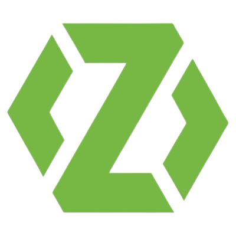
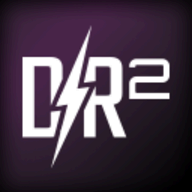

### Hello! I'm [Ángel Siendones Sillero](https://www.linkedin.com/in/angel-siendones-sillero/)! (/0.0)/

### About me

* 🗺 Spanish, English.
* 🏳️‍🌈 He/Him.
* 🎮 Game developer.
* 🏗 Software architecture & development processes enthusiast.

## Technologies I'm used to

 
 

---

## Readings

📚 Index:

* Inspiring => 🚀️
* Favourite => ⭐️

### Books

📖 Current readings:

* C++ for C# Developers; Jackson Dustan.
* Object-Oriented Programming. An Objetive Sense of Style; K.Lieberherr, I.Holland, A.Riel
* Assuring Good Style for Object-Oriented Programs; K.Lieberherr & I.Holland
* Unit Testing Principles, Practices and Patterns; Vladimir Khorikov.

📕 Previous readings:

* TDD by Example; Kent Beck. ⭐️
* Extreme Programming Explained (2nd edition); Kent Beck. ⭐️ 🚀️
* The Clean Coder: A Code of Conduct for Professional Programmers; Robert Martin. 🚀️
* Domain-Driven Design; Eric Evans. ⭐️ 🚀️
* Clean Architecture: A Craftsman's Guide to Software Structure and Design: A Craftsman's Guide to Software Structure and Design; Robert Martin.
* Game Programming Patterns; Robert Mystrom.
* The Gamedev Business Handbook; Michael Futter.
* Theory of Fun for Game Design; Raph Koster.
* Clean Code: A Handbook of Agile Software Craftsmanship; Robert Martin. 🚀️
* Mythical Man-Month, The: Essays on Software Engineering, Anniversary Edition; Fred Brooks. ⭐️

🔍 Next readings:

* Design By Contract; Bertrand Meyer.
* UML Distilled 3rd Ed; Martin Fowler.
* Head First Design Patterns; Eric Freeman, Elisabeth Robson, Bert Bates, Kathy Sierra.
* Refactoring: Improving the Design of Existing Code; Martin Fowler.
* Working Effectively with Legacy Code; Michael C. Feathers.
* Peopleware: Productive Projects and Teams; Tom DeMarco, Timothy Lister.

💎 Future readings:

* Object Oriented Analysis and Design with Applications; Grady Booch.
* Object Oriented Software Construction; Bertrand Meyer.
* Extreme Programming Adventures in C#; Ron Jeffries.
* Patterns of Enterprise Application Architecture; Martin Fowler
* Continuous Delivery - Reliable Software Releases Through Build, Test And Deployment Automation; Dave Farley & Jez Humble.
* Extreme Programming Installed; Ron Jeffries.
* The Art of Unit Testing; Roy Osherove.
* C# In Depth; Jon Skeet.
* The Pragmatic Programmer.
* xUnit Test Patterns Refactoring Test Code; Gerard Meszaros.
* The Art of Readable Code; Dustin Boswell & Trevor Foucher.
* Code Complete, 2nd Edition; Steve McConnell.
* A Playful Production Process: For Game Designers (and Everyone); Richard Lemarchand.
* Design Patterns Elements of Reusable Object-Oriented Design.
* Unified Software Development Process; Ivar Jacobson, Grady Booch, James Rumbaugh.
* Game Engine Architecture; Jason Gregory.
* Unity Shaders Bible; Fabrizio Espíndola.

### Other Cool Readings (Under Construction)

* Flaccid Scrum; Martin Fowler. ⭐️
* Developers Should Abandon Agile; Ron Jeffries.
* The Humble Programmer; Edsger W. Dijkstra. ⭐️
* No Silver Bullet — Essence and Accidents of Software Engineering; Fred Brooks. ⭐️

---

## Cool Presentations (Under Construction)

* Patterns of Effective Teams • Dan North • GOTO 2017. ⭐️ 🚀️
* Surviving the Apocalypse. Finding New Life after Deleting Everyone's Data - The 2019 Failure Workshop (GDC); Charley Price. ⭐️
* Overthrowing the MonoBehaviour Tyranny in a Glorious Scriptable Object Revolution - Unite 2016; Richard Fine.  🚀️
* Disentangle the Data Enterprise Spaghetti to continuous delivery; Kenny Baas. ⭐️
* Architecting The Unknown - SATURN 2016 Keynote; Grady Booch. 🚀️

---

 

## Recent activity

### GitHub

### Technologies used in these repos

 
